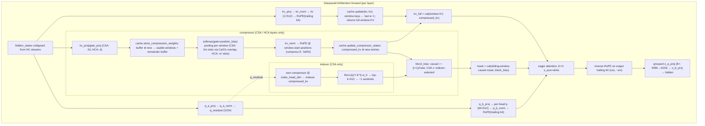

# DeepSeek-V4-Flash Cache Architecture

Status: verified against pinned source and tiny-model runtime evidence on 2026-07-16.
All claims below cite executable source. Nothing here is inferred from names alone.

## Sources of truth (pinned)

| Repo | Revision | Role |
|---|---|---|
| `vendor/DeepSeek-V4-Flash` (HF `deepseek-ai/DeepSeek-V4-Flash`) | `60d8d70770c6776ff598c94bb586a859a38244f1` | Official reference inference (`inference/model.py`, `inference/kernel.py`) — authoritative for numerics/QAT policy. Weights NOT downloaded (LFS pointers only). |
| `vendor/transformers` (HF Transformers) | `150eb7c9ed4091294c829fa0e9466b090cb0f87f` (v5.15.0.dev0, main @ 2026-07-16) | Runnable implementation (`src/transformers/models/deepseek_v4/`) — what our tiny-model tests and quantization experiments execute. |

Canonical Transformers source is `modular_deepseek_v4.py`; `modeling_deepseek_v4.py` is
**generated** from it by `make fix-repo` (see `vendor/transformers/CLAUDE.md`). Never edit the
generated file; wrap/subclass externally, or edit the modular file and regenerate.

Runtime evidence: `tools/inspect_v4_cache.py` (tiny random model, no weights) and
`tests/test_v4_cache_semantics.py`.

## 1. High-level picture

DeepSeek-V4 is **not** V2/V3 MLA. There is no `kv_a_proj_with_mqa`, no `kv_lora_rank`, no
latent→`kv_b_proj` reconstruction. Instead:

- **Shared-KV MQA**: one single KV "head" per token (`num_key_value_heads=1`), of width
  `head_dim=512`, and **the same tensor is used as both K and V** (`Attention.forward` passes
  `kv, kv` into the attention interface; the official kernel takes a single `kv` tensor).
- **Partial RoPE, trailing slice**: each 512-dim vector is `[nope(448) | rope(64)]`. RoPE is
  applied to the *last* `qk_rope_head_dim=64` dims (`x[..., -rd:]` in both implementations).
  Because V doubles as K, the attention **output** gets the *inverse* rotation applied to its
  trailing rope slice (`apply_rotary_emb(o, freqs, inverse=True)` official;
  `apply_rotary_pos_emb(attn_output, cos, -sin)` HF) so V contributions depend only on relative
  position.
- **Every layer has a sliding-window branch** (`sliding_window=128`); compressed layers
  additionally maintain **compressed KV entries** (1 per `compress_rate` tokens) that are
  **concatenated onto the KV axis** at attention time.
- **Three attention layer types** (`config.layer_types`, derived from legacy per-layer
  `compress_ratios` `[0,0,4,128,4,128,…,4,0]` in the shipped `config.json`):

| layer type | compress rate | count in V4-Flash (43 layers) | extra machinery |
|---|---|---|---|
| `sliding_attention` | — (ratio 0) | 3 (layers 0, 1, 42) | none |
| `compressed_sparse_attention` (CSA) | m = 4 | 20 (odd layers 2–41... interleaved) | overlapping compressor **+ Lightning Indexer** (top-k=512 sparse selection) |
| `heavily_compressed_attention` (HCA) | m′ = 128 | 20 | non-overlapping compressor, attends **densely** to all compressed entries |

- **Per-head attention sink** (`sinks`/`attn_sink`, fp32): added to the softmax denominator
  (gpt-oss-style `s_aux`).
- **RoPE has two parameterizations** (`config.rope_parameters` keys, *not* layer types):
  `main` (θ=10 000, no YaRN) for sliding-only layers; `compress` (θ=160 000, YaRN factor 16,
  `attention_factor` forced to 1.0) for CSA/HCA layers *and* their compressors/indexers.
- Q path is low-rank: `q_a_proj(4096→1024) → RMSNorm → q_b_proj(1024→64·512)`, then an
  **unweighted RMSNorm over each head's 512 dims** (`q_b_norm`; official: `q *= rsqrt(mean(q²))`),
  then partial RoPE. Output path is grouped low-rank: heads split into `o_groups=8` groups of
  4096, per-group `o_a_proj` (4096→1024, block-diagonal `DeepseekV4GroupedLinear`), concat →
  `o_b_proj` (8·1024→4096).
- Non-cache but load-bearing context: hyper-connection residual streams (`hc_mult=4` copies of
  the hidden state, Sinkhorn-normalized mixing), MoE with 256 routed experts
  (`sqrtsoftplus` scoring; first 3 layers hash-routed by token id), MTP layer (ignored by HF:
  `_keys_to_ignore_on_load_unexpected = mtp.*`).

## 2. Cache state inventory (Transformers implementation)

Cache container: `DynamicCache(config=...)` (`cache_utils.py:1653`) dispatches per layer via
`DYNAMIC_LAYER_TYPE_MAPPING`; V4's cache layer classes self-register through
`CacheLayerMixin.__init_subclass__` (`cache_utils.py:35`) using `_layer_type`:

| `config.layer_types[i]` | cache layer class | defined at |
|---|---|---|
| `sliding_attention` | `DynamicSlidingWindowLayer` | `cache_utils.py:190` |
| `compressed_sparse_attention` | `DeepseekV4CSACache` | `modular_deepseek_v4.py:218` |
| `heavily_compressed_attention` | `DeepseekV4HCACache` | `modular_deepseek_v4.py:134` |

`get_layer_types_and_kwargs` (`cache_utils.py:1617`) passes `sliding_window` to all and the whole
`config` to CSA/HCA layers.

### Per-state table

Shapes verified at runtime with B=2, S=21, tiny config (window=8, csa=4, hca=8, head_dim=32,
index_head_dim=16). Symbolic shapes below use the real model's values: `d=512` (`head_dim`),
`rd=64` (rope), `dI=128` (`index_head_dim`), `w=128` (window), `m=4`, `m′=128`.

| # | State | Owner (class.attr) | Shape | dtype @ write | Lifetime / cadence | Written by | Read by |
|---|---|---|---|---|---|---|---|
| 1 | Window keys (=values) | `DynamicSlidingWindowLayer.keys` / `DeepseekV4{CSA,HCA}Cache.keys` | `[B, 1, ≤w−1, d]` (post-RoPE) | model dtype (BF16) | persistent ring-ish window; every forward | `update()` (`modular:167` / `cache_utils:208`) | attention interface (`modular:742`); returned `full = cat(prev, new)` |
| 1b | Window values | same tensor as keys on CSA/HCA layers (`self.values = self.keys`, `modular:174,178`); **separate copy** on stock sliding layers | — | — | — | — | — |
| 2 | Main compressed KV | `…Cache.compressed_kv["compressor"]` | `[B, T, d]`, `T = tokens_seen // rate` | model dtype (post `kv_norm` + RoPE) | persistent, append-only; +1 entry per `rate` tokens | `update_compressor_states` (`modular:204`) | `Attention.forward` concat (`modular:725`) |
| 3 | Compressor buffer (kv, gate) | `…Cache.buffer_kv["compressor"]`, `buffer_gate["compressor"]` | HCA: `[B, <m′, d]` ×2; CSA: `[B, <m, 2d]` ×2 | `kv_proj`/`gate_proj` output dtype (BF16) | bounded temporary (< rate tokens); drained at each window close | `store_compression_weights` (`modular:181`) | same fn next call |
| 4 | CSA overlap state (Ca slice) | `DeepseekV4CSACache.overlap_kv["compressor"]`, `overlap_gate["compressor"]` | `[B, m, d]` ×2 | BF16 | bounded (exactly one window); overwritten every window close | `update_overlap_state` (`modular:249`) | CSA compressor window-0 fill (`modular:599–605`) |
| 5 | Entry counter | `…Cache.entry_count["compressor"]` | python int | — | persistent; `entry_count·rate` = abs position of next window | `update_compressor_states` | RoPE positions (`modular:355,613`) |
| 6 | Indexer compressed KV | `DeepseekV4CSACache.compressed_kv["indexer"]` | `[B, T, dI]` | model dtype | persistent, append-only, same cadence as #2 (CSA layers only) | `DeepseekV4Indexer.forward` → `update_compressor_states` (`modular:496`) | `DeepseekV4IndexerScorer` (`modular:391`) |
| 7 | Indexer buffer / overlap / count | `buffer_kv["indexer"]` `[B, <m, 2dI]`, `overlap_kv["indexer"]` `[B, m, dI]`, `entry_count["indexer"]` | analogous to #3/#4/#5 | BF16 | bounded / persistent counter | `Indexer.forward` | `Indexer.forward` |

Notes established at runtime:

- `cumulative_length` (on every layer) tracks *total tokens seen*; `get_seq_length()` returns it,
  while `keys.shape[-2]` saturates at `w−1 = 127` (window keeps last `sliding_window − 1` and
  returns `cat(kept, new)` from `update`, so attention sees ≤ `w−1 + S_new` window entries).
- On CSA/HCA layers K and V verifiably share storage (`values.data_ptr() == keys.data_ptr()`);
  the stock `DynamicSlidingWindowLayer` on sliding-only layers keeps **two identical copies** —
  a ~2× memory waste on those 3 layers that a custom storage layer can reclaim.
- Buffers/overlap states live in the projection output dtype (BF16 on the real model; fp32 in
  our fp32 tiny model). `position_bias`, `sinks`, and several norms are pinned fp32 via
  `_keep_in_fp32_modules_strict` (`modular:1059`).

### Write/read cadence detail

**Prefill (S tokens, cache present):** `Attention.forward` → `kv_norm(kv_proj(h))` → RoPE →
`past_key_values.update(kv, kv, layer_idx)` (window write) → compressor:
`store_compression_weights` concats buffer+new, splits off `usable = ⌊len/rate⌋·rate`, keeps
remainder in buffer → pools `usable/rate` windows (softmax over gate+position_bias, fp32) →
`kv_norm` → RoPE at positions `entry_count·rate + i·rate` (window-start absolute positions,
`compress` rope type) → `update_compressor_states` appends → attention over
`cat(window_kv, compressed_kv)` with `block_bias` extending the mask (`modular:733–737`).

**Decode (1 token):** same path; compressor emits exactly one new entry when
`cumulative_length` crosses a multiple of `rate`, else only the buffer grows.

**CSA two-series overlap:** `kv_proj`/`gate_proj` emit `2·d` per token — series Ca
(`[..., :d]`, contribution to *next* window's entry) and Cb (`[..., d:]`, contribution to
*current* window's entry). Entry `w` = softmax-gated sum over `2m` slots: window `w−1`'s Ca ∪
window `w`'s Cb (effective width `2m`, stride `m`). Window 0 uses the cached `overlap_kv` from
the previous forward (zero-kv/`−inf`-gate on the very first call → softmax weight 0).
HCA is single-series, non-overlapping (`m′=128` plain windows).

**Indexer (CSA layers only):** runs its own compressor clone at `dI=128` over the same windows,
then scores `Σ_h w_{t,h} · ReLU(q^I_{t,h} · K^I_s)` (`modular:391–395`, fp32) with
`q^I = q_b_proj(q_residual)` RoPE'd at query positions; picks top-`index_topk=512` entries;
invalid (future) picks become `-1` sentinels; the CSA compressor scatters `0` bias at selected
slots, `−inf` elsewhere (`modular:629–638`). HCA has **no indexer** — dense over compressed
entries with only a causal `block_bias` (`modular:371–379`).

**Causality rule for compressed entries:** query at position `t` may see entry `i` iff
`i < (t+1) // rate` (entry `i` covers source positions `[i·rate, (i+1)·rate)`).

## 3. Official reference implementation (inference/model.py) — storage & QDQ policy

The official implementation is functionally equivalent but architecturally different storage:

| Aspect | Official (`inference/model.py`) | Transformers |
|---|---|---|
| Window storage | preallocated ring buffer `kv_cache[:, :win]`, `[max_B, win + max_S/rate, d]` buffer per Attention module (`model.py:473–474`), non-persistent `register_buffer` | dynamic `torch.cat`, keeps last `w−1` |
| Compressed storage | same buffer, slots `[win:]`, written at `kv_cache[:, win + start_pos//ratio]` (`model.py:374–376`) | separate append-only `compressed_kv` tensors |
| Incomplete-window state | fp32 `kv_state`/`score_state` `[max_B, coff·ratio, coff·d]` buffers on `Compressor` (`model.py:303–304`) | BF16 `buffer_kv`/`buffer_gate` dicts on the cache layer |
| Sparse read | `sparse_attn` kernel gathers by `topk_idxs` (window ring positions + offset compressed positions), `-1` = masked (`kernel.py:277–368`) | dense attention over concat + additive mask |
| Attention math | manual online-softmax kernel with `attn_sink` in denominator | eager path with `s_aux=sinks` |

### Official QDQ policy at the cache write boundary (QAT-aligned) — the numerics we must reproduce

All QDQ is **in-place quantize→dequantize back to BF16** (storage stays BF16 in this reference
code; comments state the kernels/kv could use real FP8 storage):

| Target | Call site | Function & parameters | Effect |
|---|---|---|---|
| Main KV, non-RoPE dims (window entries) | `model.py:506` | `act_quant(kv[..., :-64], block_size=64, scale_fmt="ue8m0", inplace=True)` | FP8 `e4m3` QDQ per contiguous **group of 64** along the feature dim; absmax scale rounded **up to a power of 2** (`fast_round_scale`, `kernel.py:36`: `2^ceil(log2(amax/448))`); clamp ±448; floor `amax ≥ 1e-4` |
| Main compressed KV, non-RoPE dims | `model.py:372` | same `act_quant(kv[..., :-rd], 64, …, inplace=True)` after compressor norm+RoPE | same |
| Main KV RoPE dims (last 64) | — | **never quantized** | BF16 "for positional precision" (`model.py:505` comment) |
| Indexer compressed KV (full `dI=128`) | `model.py:368–370` | `rotate_activation` (randomized Hadamard, `fast_hadamard_transform`) then `fp4_act_quant(kv, block_size=32, inplace=True)` | FP4 `e2m1` QDQ per group of **32**, power-of-2 `e8m0` scale (round up, `amax/6`, floor `6·2⁻¹²⁶`), clamp ±6 — applied to the *whole* vector including its rope slice |
| Indexer queries | `model.py:414–416` | same Hadamard + `fp4_act_quant(q, 32, True)` | symmetric with indexer keys |
| Compressor fp32 states | — | not quantized (fp32) | — |
| Attention compute | `model.py:527` comment | "We performed QAT here, kv could also use fp8 format, though current implementation uses bf16" | BF16 GEMMs after QDQ |

The **Transformers implementation has no QDQ at all** — pure BF16 cache numerics. Reproducing
the official `act_quant`/`fp4_act_quant` semantics at the HF cache boundary **is exactly the
Task 02 scope** ("official-policy QDQ simulation").

Weight quantization context (separate concern from KV): checkpoint is FP8 e4m3 block 128×128
with `ue8m0` scales (`config.json: quantization_config`); routed experts FP4
(`expert_dtype: "fp4"`, packed `float4_e2m1fn_x2` + per-32 `e8m0` scales, `model.py:131–137`).

## 4. Call-flow diagram

## 5. Quantization surface (summary — details in QUANTIZATION_INJECTION_PLAN.md)

| Cache state | Working hypothesis (CLAUDE.md) | Verified official policy | Candidate QDQ injection (HF impl) | Candidate real-storage injection |
|---|---|---|---|---|
| Window KV non-rope (448) | FP8 baseline / FP4 experimental | FP8 e4m3, groups of 64, ue8m0 round-up scales | wrap cache-layer `update()` (subclass) | replace `keys` storage in custom layer subclass |
| Window KV rope (64) | BF16 initially | BF16 (never quantized) | keep precise slice untouched | store separately or inline BF16 |
| CSA/HCA compressed KV non-rope | FP8 baseline | FP8 e4m3 g64 ue8m0 (post norm+RoPE) | wrap `update_compressor_states()` | quantize on append, dequant on read |
| CSA/HCA compressed KV rope | BF16 initially | BF16 | untouched | BF16 |
| Indexer compressed KV (full 128) | official low-precision/QAT path | Hadamard + FP4 e2m1 g32 e8m0 (whole vector) | wrap indexer `update_compressor_states()`; must also QDQ indexer *queries* symmetrically | packed FP4 nibbles + e8m0 scales |
| Compressor buffers / overlap / gates | BF16/full precision | fp32 (official) / BF16 (HF) | none initially | none initially |
| Counters/metadata | full precision | int | — | — |

## 6. Constraints & behaviors that shape testing and quantization

1. **Eager-only**: FA2/3 reject `head_dim=512` (>256 cap); SDPA lacks sinks; FlexAttention can't
   handle mid-block KV growth (`modular:1032–1050`).
2. **Left padding is unsupported by design**: compressor pools windows *before* masking, so pads
   get folded into pooled entries (upstream skips `test_left_padding_compatibility`,
   `modular` test file:220–229). All our tests use unpadded, right-aligned inputs.
3. **`QuantizedCache` is incompatible** with V4 cache layers (upstream skip note, test:122–126) —
   our quantized cache must subclass the V4 layer classes, not the generic quantized cache.
4. **Not rewindable**: `_is_stateful = True`; compressor buffers can't be rolled back (no
   assisted decoding / crop beyond window). Quantized-cache design must not assume `crop()`.
5. **`use_cache=False` path**: compressors run in stateless single-shot mode
   (`past_key_values is None` branch) — complete windows compressed, remainder discarded, no
   state anywhere.
6. **Chunked prefill must respect window alignment of *state*, not of chunks**: buffers carry
   remainders across chunk boundaries; `entry_count` anchors RoPE positions absolutely, so
   arbitrary chunk sizes are exact (verified by tests).
7. **Dtype pinning**: `sinks`, `position_bias`, HC params, several norms fp32
   (`_keep_in_fp32_modules_strict`); compressor/indexer projections in the FP8 checkpoint ship
   BF16 (non-strict `_keep_in_fp32_modules`, `modular:1076`).

## 7. Uncertainties requiring full-model validation (RunPod phase)

1. **Numerical equivalence HF ↔ official** cannot be checked without weights (different storage,
   kernels, and fp32-promotion points). Teacher-forced logit comparison on the real checkpoint
   is the RunPod gate.
2. **`scale_dtype`**: official `ModelArgs.scale_dtype="fp8"` → scales stored as
   `float8_e8m0fnu` in kernels; whether e8m0 vs fp32 scale storage matters for quality must be
   measured on the real model.
3. **Hadamard transform exactness**: `fast_hadamard_transform` package (`model.py:251`) vs a pure
   PyTorch Hadamard — bitwise differences possible; quality impact must be validated.
4. **`hash_moe` `tid2eid` table** is checkpoint-provided; random tiny models can't validate
   real routing distributions (affects activation statistics for calibration, not cache
   semantics).
5. **YaRN at real scale**: tiny models use `rope_type="default"`; the real config uses YaRN
   factor 16 with `original_max_position_embeddings=65536`. Compress-rope numerics at long
   context need full-model verification.
6. **MTP layer** (`num_nextn_predict_layers=1`) is not instantiated by HF; if MTP-based speedups
   are ever benchmarked, its cache interaction is unmapped.
7. Sliding-only layers' `values` double-storage (stock `DynamicSlidingWindowLayer`) — memory
   accounting on the real model should count it; a custom shared-storage layer is a easy win to
   validate there.
